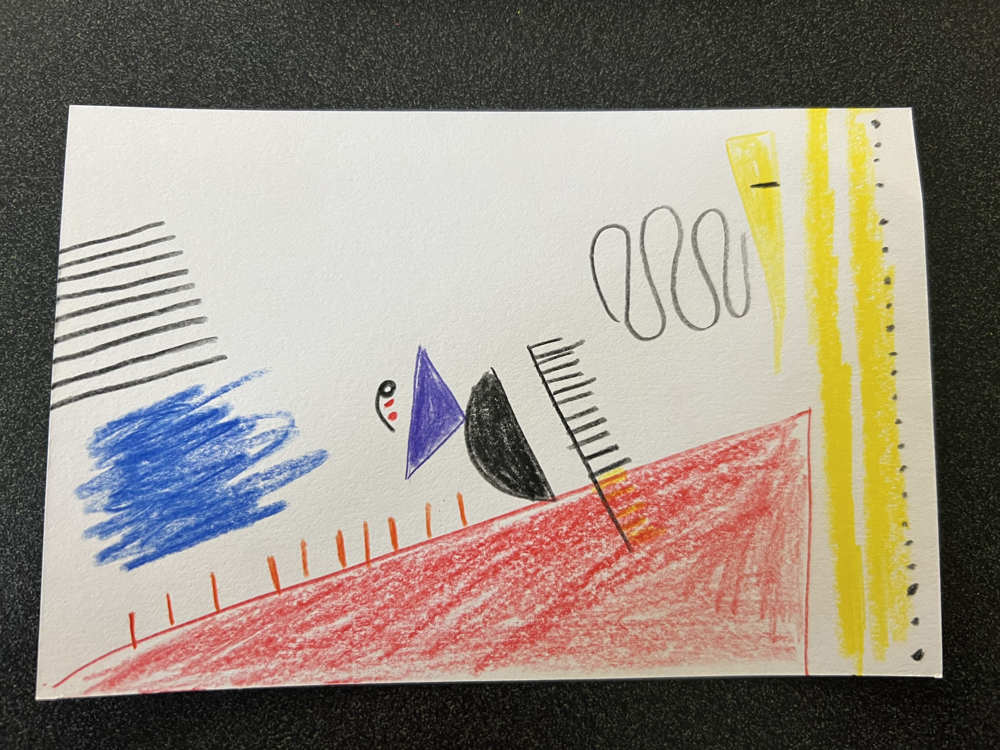

# Week 01

## About Me

My name is Giorgio Vidali and I am currently a 2nd Year in the MPCS program. I also attended UChicago for undergrad! My favorite part of CS is data-science/data-analysis so I am really excited for this course. Personally, I am half Brazilian and Italian and very excited for the upcoming World Cup (I know Italy didn't qualify). This is my last quarter at UChicago and I am exicted for things to come!!!