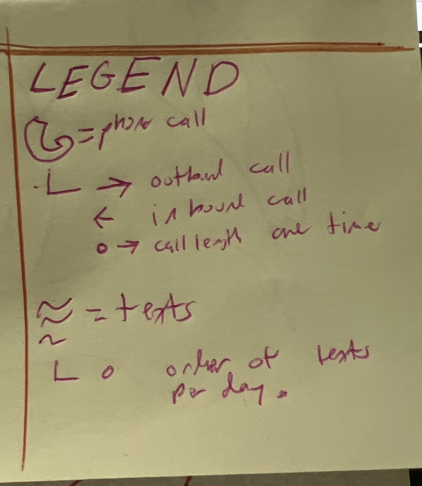
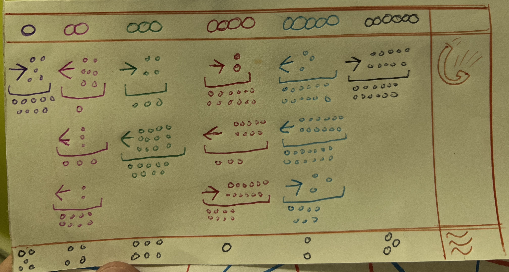

# Giorgio Vidali

# Week 02

## About the Project

I decided to focus on communications between me and my father for this project. We speak extremely frequently so I knew this would be well populated dataset. In particular, I tracked the calls and texts we make to eachother and also whether its in or outgoing from my standpoint. I also tracked the quantity and time we call we eachother. 

To represent this data I chose a phone to represent calls, lines to represent texts, and dots to represent either absolute or unit numbers. I made this variable to add more of an artisitc flair to my project and for people to be able to see trends in our convsersation.

